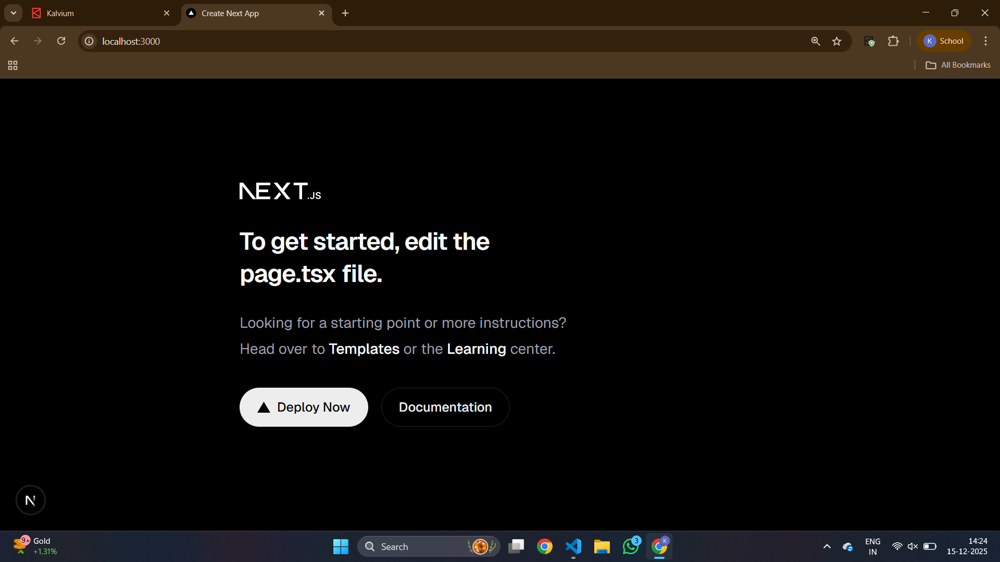

# QConnect – A Lightweight Digital Queue Management System

QConnect is a streamlined, cost-effective digital queue management solution designed to help hospitals in Tier-2 and Tier-3 cities modernize patient flow without investing in expensive infrastructure. The system enables patients to join virtual queues and receive real-time updates, significantly reducing on-site congestion and improving operational efficiency.

📌 Overview

Many hospitals in smaller cities rely on traditional physical queues, leading to overcrowding, long wait times, and administrative challenges. QConnect addresses this gap by providing an easy-to-deploy digital queueing platform that works seamlessly on basic smartphones and existing hospital systems.

✨ Key Features

Virtual Queueing: Patients can join queues remotely or on-site via QR code.

Real-Time Updates: Instant notifications on queue status and expected wait times.

Low Infrastructure Requirement: Operates using basic devices and a stable internet connection.

Administrative Dashboard: Simple interface for staff to manage and monitor patient queues.

Scalable Design: Easily adaptable for different departments or clinics.

🎯 Objective

To create an accessible, low-cost digital solution that enhances patient experience and optimizes hospital workflow in resource-constrained environments.

🛠️ Technology Stack

Frontend: HTML, CSS, JavaScript / React

Backend: Node.js / Firebase / Any lightweight backend

Database: Firebase / MongoDB

Deployment: Cloud hosting or on-premise lightweight server

🚀 Workflow

Patient scans a QR code or enters the hospital code.

Selects the department and joins the digital queue.

Receives a queue token and real-time progress updates.

Hospital staff manage queues through the admin dashboard.

📦 Installation & Setup
git clone https://github.com/your-repo/QConnect.git
cd QConnect
npm install
npm start

🧑‍💼 Team

Member 1

Member 2

Member 3

📄 License

This project is licensed under the MIT License.



## Docker & Docker Compose Setup

This project uses Docker and Docker Compose to run the full stack locally.

### Services
- Next.js App – http://localhost:3000
- PostgreSQL – Port 5432
- Redis – Port 6379

### Run Locally
```bash
docker-compose up --build


## PostgreSQL Schema Design

### Entities
User, Doctor, Queue, Appointment

### Relationships
- User → Appointment (1:N)
- Doctor → Queue (1:N)
- Queue → Appointment (1:N)

### Constraints
- Unique email for users
- Unique token per queue
- Cascading deletes

### Normalization
- 1NF: Atomic attributes
- 2NF: No partial dependency
- 3NF: No transitive dependency

## Prisma ORM Setup & Client Initialization

### Purpose
Prisma ORM is used to interact with the PostgreSQL database using type-safe queries and a generated client.

### Setup Steps
- Initialized Prisma with PostgreSQL
- Defined models in schema.prisma
- Generated Prisma Client
- Created a singleton Prisma Client for Next.js

### Prisma Client Initialization
```ts
import { PrismaClient } from "@prisma/client";

const globalForPrisma = globalThis as unknown as {
  prisma: PrismaClient | undefined;
};

export const prisma =
  globalForPrisma.prisma ??
  new PrismaClient({
    log: ["query", "info", "warn", "error"],
  });

if (process.env.NODE_ENV !== "production") {
  globalForPrisma.prisma = prisma;
}
